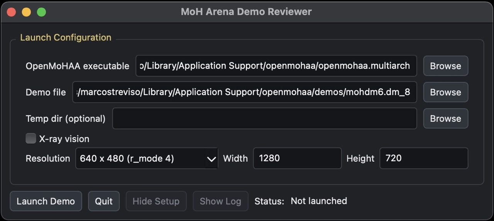
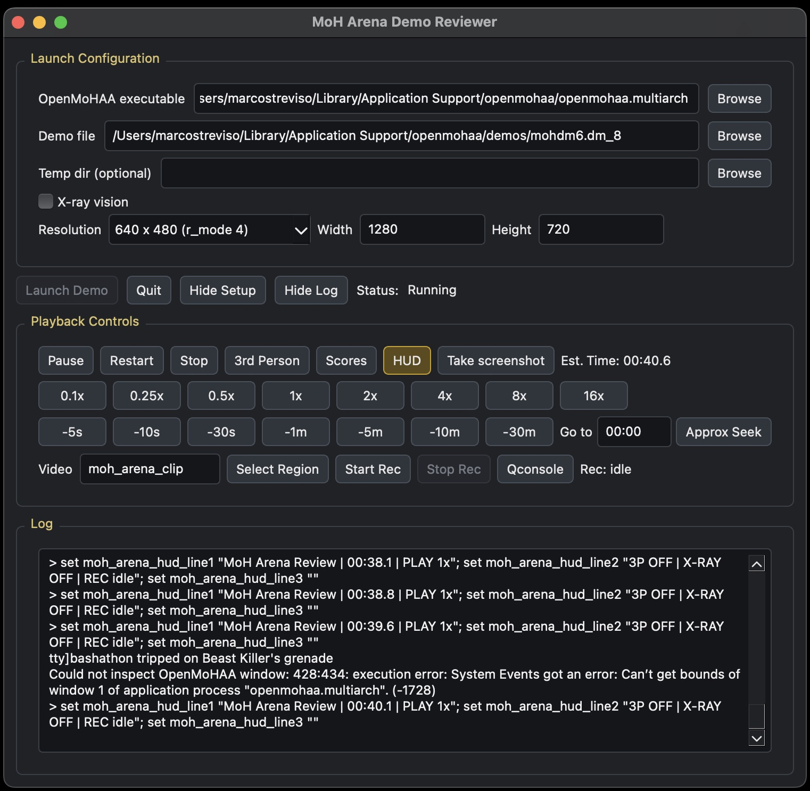
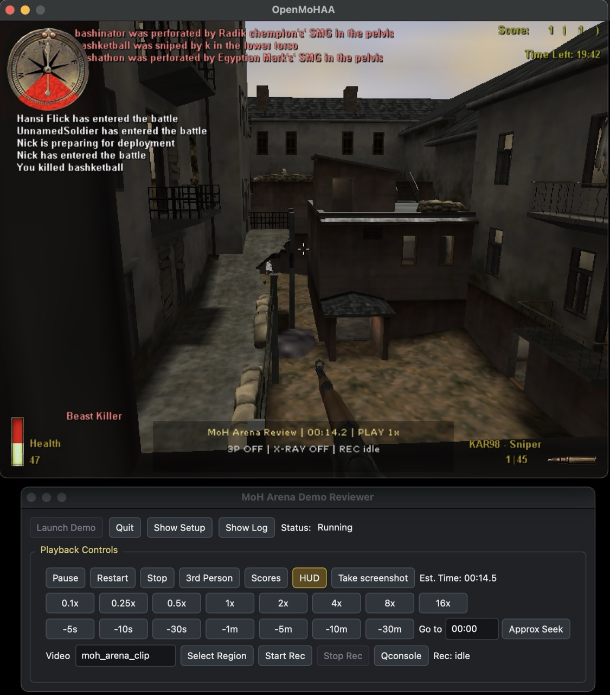
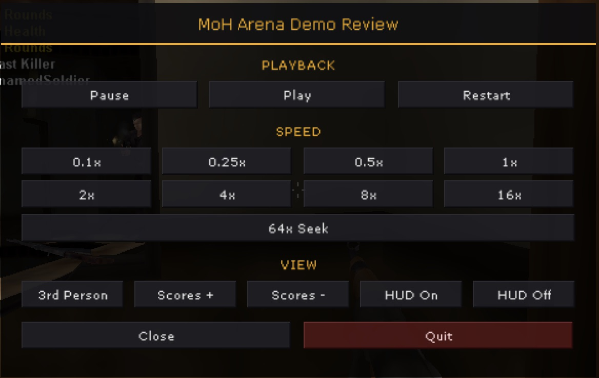

# MoH Arena Demo Reviewer

Local desktop demo review/player tool for MOHAA anti-cheat review. The app does
not parse or render MOHAA demos itself. It launches OpenMoHAA in windowed mode
and controls playback through OpenMoHAA's `com_pipefile` FIFO.

Therefore, this tool works only on **macOS** and **Linux** for now.

> Note: The OpenMoHAA source creates `com_pipefile` through `Sys_Mkfifo` on Unix-like systems, while the Windows implementation returns `NULL`; Windows pipe control is therefore not available in this v1 app.

## Screenshots

| Launch configuration | Playback controls and live log |
| --- | --- |
|  |  |

| In-game HUD overlay with the compact controller | Redesigned in-game control menu (F10) |
| --- | --- |
|  |  |

## Setup

You need four things:

1. Python 3.10 or newer.
2. OpenMoHAA installed locally.
3. MOHAA game assets in the same folder as the OpenMoHAA executable.
4. FFmpeg if you want video recording.

The app does not include MOHAA game assets. In the GUI you only select the
OpenMoHAA executable; the app infers the MOHAA basepath from that executable's
folder.

## Installation

From the workspace root:

```bash
python3 -m venv .venv
source .venv/bin/activate
python -m pip install -r requirements.txt
python -m moh_arena_demo_reviewer
```

You can also install directly from `pyproject.toml`:

```bash
python -m pip install -e .
```

For running tests, install the dev extra:

```bash
python -m pip install -e ".[dev]"
```

On macOS, these installs include `pyobjc-framework-Quartz` so the app can find
the exact OpenMoHAA window rectangle for FFmpeg recording.

## Install FFmpeg if you want recording:

On MacOS:
```bash
brew install ffmpeg
```

On Linux:
```bash
sudo apt install ffmpeg
```

Linux recording uses FFmpeg `x11grab`, so it expects an X11 session with
`DISPLAY` set.


## Launch Shape

The app launches OpenMoHAA with arguments equivalent to:

```bash
openmohaa \
  +set fs_basepath "/path/to/MOHAA" \
  +set fs_homepath "/tmp/moh-arena-review-xxxx" \
  +set r_fullscreen 0 \
  +set r_mode -1 \
  +set r_customwidth 1280 \
  +set r_customheight 720 \
  +set r_noborder 0 \
  +set in_nograb 1 \
  +set com_pipefile moh_arena_pipe \
  +set cheats 1 \
  +set sv_cheats 1 \
  +set timedemo 0 \
  +set timescale 1 \
  +set cl_freezeDemo 0 \
  +exec moh_arena_demo_review.cfg \
  +demo review
```

## Game Files

The launch assets are committed, hand-editable game files under
`moh_arena_demo_reviewer/game_files/`, copied verbatim into each review homepath
at launch (they used to be generated on the fly in Python):

```text
moh_arena_demo_reviewer/game_files/moh_arena_demo_review.cfg
moh_arena_demo_reviewer/game_files/autoexec.cfg
moh_arena_demo_reviewer/game_files/ui/moh_arena_demo_review.urc
moh_arena_demo_reviewer/game_files/ui/moh_arena_demo_hud_ui.urc
```

Edit those files directly to tweak the in-game menu, the HUD overlay, the
fallback binds, or the default cvars. For each launch, the app prepares a
temporary homepath containing:

```text
<homepath>/main/demos/review.dm_8
<homepath>/main/moh_arena_demo_review.cfg
<homepath>/main/autoexec.cfg
<homepath>/main/ui/moh_arena_demo_review.urc
<homepath>/main/ui/moh_arena_demo_hud_ui.urc
<homepath>/main/qconsole.log
<homepath>/main/screenshots/
```

The in-game `.urc` menu (toggle with `F10`) is a fallback for the Python
controller. It groups playback, speed, third-person, score show/hide, and HUD
on/off as `stuffcommand` console commands. FFmpeg recording stays in the Python
GUI because it depends on the selected capture region and local process state.
Scoreboard fallback keys are `F9` for `+scores` and `F11` for `-scores`; `F12`
remains screenshot. X-ray review is not baked into the config; when enabled the
app appends `+set cg_forceModel 0 +set dm_playermodel american_army +set
dm_playergermanmodel german_wehrmacht_soldier` to the launch command and copies
the x-ray pk3 into the homepath.

The app enables client qconsole diagnostics with `logfile 2` and
`logfile_timestamps 1`. It also tees OpenMoHAA stdout/stderr into
`<homepath>/main/qconsole.log` from Python, so the Qconsole button has a real
file to reveal even if OpenMoHAA's internal logfile cvar does not write one.
The reviewer does not force `developer 1` by default because OpenMoHAA opens the
developer console UI during cgame startup, and an active UI layer can suppress
the scoreboard.

## In-game review HUD

The in-game HUD is a client UI overlay. `ui/moh_arena_demo_hud_ui.urc` defines
`Label` widgets bound with `linkcvar` to `moh_arena_hud_line1..3`, so the app
drives the text purely by `set`-ing those cvars over `com_pipefile`. The overlay
is shown automatically on launch; the **HUD** button (and the in-game menu's
**HUD On/Off**) toggles it with `ui_addhud` / `ui_removehud` — the no-focus HUD
layer that keeps rendering during demo playback.

This replaces the earlier server-script HUD, which could never work during
playback: `huddraw_*` are server game-module *script* commands, and a demo runs
client-only with no script VM, so `global/*.scr` (including the old
`DMprecache.scr` hook) never executes in a demo. The abort previously seen with
runtime `loadmenu` came from its `CreateMenus()` freeing menu objects that
`UI_Update` still pointed at; the overlay avoids that entirely by relying on
OpenMoHAA's startup autoload of `ui/*.urc` and never calling `loadmenu` at
runtime. The app still sets `fps 0` to keep debug/FPS text out of review
recordings.

FFmpeg recordings are saved outside that temporary homepath:

```text
<inferred fs_basepath>/main/videos/<name>.mp4
```


## Tests

```bash
python -m pytest
```

The tests do not require OpenMoHAA or MOHAA assets.
